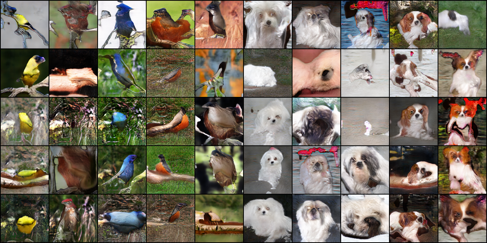
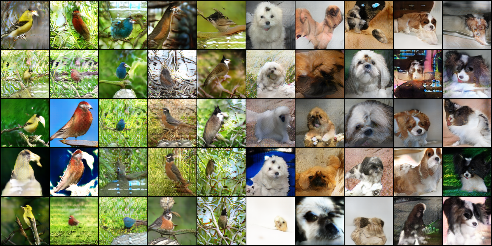

# sagan-pytorch

Self-Attention Generative Adversarial Networks (SAGAN, https://arxiv.org/abs/1805.08318) in PyTorch

Usage:

> python train.py PATH

Input directory should be structured like this (as with torchvision.datasets.ImageFolder):

> PATH/class1  
> PATH/class2  
> ...

Code for evaulate FID score came from https://github.com/bioinf-jku/TTUR

## Notes

Sample from DCGAN generator (without residual connection) at 120k iteration. Seems like that model size is insufficient. FID is about 120. After this model is collapsed.

Sample from ResNet generator 290k iteration. FID is about 64.8. Used imbalanced learning schedule for generator vs discriminator, namely, 1:5 update schedule. Sample quality seems like improved, might because increased model size and more stable learning schedule. Train resnet model with 1:1 update schedule was hard and unstable.